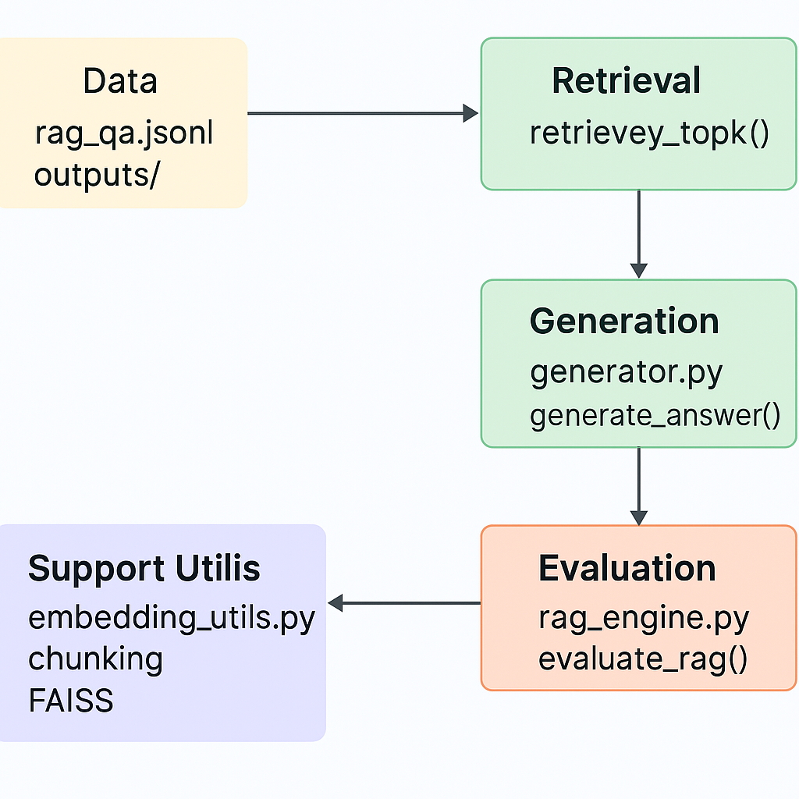

# Week 5 Reflection – AI Transformation Journey

## **August 4, 2025 — Day 1 Reflection**

### **Focus**
Built and tested the `/evaluate-rag` endpoint with retrieval & generation metrics, faithfulness check, and an automated evaluation runner over a golden set.

---

### **What I Did Today**
- Implemented retrieval (`retrieve_topk`) and deterministic generation (`generate_answer`) stubs.
- Added metrics:
  - `precision@k`
  - `recall@k`
  - `MRR`
  - `Exact Match`
  - `F1`
  - `faithfulness`
- Built a golden set with 9 Q/A pairs in `docs/golden_set/rag_qa.jsonl`.
- Created `scripts/run_eval.py` to score the golden set and output:
  - `summary.json`
  - `cases.csv`

---

### **Metrics Snapshot**
From `docs/golden_set/outputs/summary.json`:
```json
{
  "n": 9,
  "precision_at_k": 0.0,
  "recall_at_k": 0.0,
  "mrr": 0.0,
  "f1": 0.183,
  "faithfulness_supported_rate": 0.0
}

## Week 5 – File Roles and Correlations

### What Each File Does (and Why It Matters)

- **app/eval_metrics.py**  
  *What:* Pure metric functions (precision@k, recall@k, MRR, EM, F1).  
  *Why:* Gives objective numbers for retrieval and answer quality.  
  *Connects to:* Called by `app/rag_engine.py` during evaluation.

- **app/eval_router.py**  
  *What:* FastAPI route for `POST /evaluate-rag`.  
  *Why:* Exposes evaluation as an HTTP service (tooling, CI, or other apps can call it).  
  *Connects to:* Calls `evaluate_rag()` in `rag_engine.py`.

- **app/faithfulness.py**  
  *What:* Checks whether answer sentences are supported by the retrieved evidence (simple overlap heuristic).  
  *Why:* Detects hallucinations / ungrounded statements.  
  *Connects to:* Called by `rag_engine.py`.

- **app/generator.py**  
  *What:* Deterministic, extractive generator — picks best-overlap sentence(s) from retrieved chunks.  
  *Why:* Keeps evaluation reproducible (no LLM randomness).  
  *Connects to:* Called by `rag_engine.py`.

- **app/retrieval.py**  
  *What:* Wraps your FAISS/LangChain retriever; returns top-k docs as `{id, text, source}`.  
  *Why:* Standard interface for retrieval across the app.  
  *Connects to:* Called by `rag_engine.py`; uses helpers from `embedding_utils.py`.

- **docs/golden_set/outputs/SUMMARY_FAILED**  
  *What:* A flag file listing which thresholds failed (e.g., recall, faithfulness).  
  *Why:* Lets CI/CD or humans quickly see if the run is acceptable.  
  *Connects to:* Written by `scripts/run_eval.py` after aggregating metrics.

- **docs/golden_set/outputs/cases.csv**  
  *What:* Per-question metrics (p@k, r@k, MRR, EM, F1, faithfulness) and retrieved IDs.  
  *Why:* Debugging and drill-down — see which questions are failing and why.  
  *Connects to:* Written by `scripts/run_eval.py`; you read it to tune retrieval/golden set.

- **docs/golden_set/outputs/summary.json**  
  *What:* Macro metrics across the whole golden set (n, averages, rates).  
  *Why:* Headline health of the system; good for dashboards and trend tracking.  
  *Connects to:* Written by `scripts/run_eval.py`; consumed by humans/CI.

- **docs/golden_set/rag_qa.jsonl**  
  *What:* Your golden dataset: each line = `{id, question, answer, source_ids[]}`.  
  *Why:* Ground truth for evaluation; defines what “relevant” means.  
  *Connects to:* Read by `scripts/run_eval.py`; `expected_source_ids` used by metrics & faithfulness.

- **docs/reflections-week5.md**  
  *What:* Your week-wise narrative: what you built, results, insights, next steps.  
  *Why:* Institutional memory + leadership storytelling + audit trail.  
  *Connects to:* You update it with outputs from `summary.json/cases.csv`.

- **scripts/__init__.py**  
  *What:* Makes `scripts/` importable as a package.  
  *Why:* Enables `python3 -m scripts.run_eval` and clean imports of `app.*`.  
  *Connects to:* Python packaging/import system.

- **scripts/debug_retrieval.py**  
  *What:* Quick tool to print top-k retrieved IDs/text for a question.  
  *Why:* Helps align golden set `source_ids` with actual retriever IDs; speeds debugging.  
  *Connects to:* Calls `retrieve_topk()`.

- **scripts/run_eval.py**  
  *What:* Batch runner over the golden set. Produces `summary.json`, `cases.csv`, `SUMMARY_FAILED`.  
  *Why:* One command to evaluate everything; perfect for daily checks and CI gates.  
  *Connects to:* Calls `evaluate_rag()`; reads `rag_qa.jsonl`; writes outputs.

- **tests/test_eval_metrics.py**  
  *What:* Unit tests for metric functions.  
  *Why:* Guarantees the math is right; prevents silent regressions.  
  *Connects to:* Imports from `app/eval_metrics.py`.

---

### How They Correlate (End-to-End Flow)

1. **Data in** → `docs/golden_set/rag_qa.jsonl` (questions, answers, expected `source_ids`).
2. **Runner** → `scripts/run_eval.py` loops over the golden set and, for each item, calls…
3. **Orchestrator** → `app/rag_engine.py:evaluate_rag()` which:  
   - calls **retrieval** → `app/retrieval.py:retrieve_topk()`  
   - calls **generation** → `app/generator.py:generate_answer()`  
   - computes **metrics** → `app/eval_metrics.py`  
   - checks **faithfulness** → `app/faithfulness.py`  
   - returns a metrics dict
4. **Outputs out** → `scripts/run_eval.py` aggregates to `summary.json`, writes `cases.csv`, and drops `SUMMARY_FAILED` if thresholds miss.
5. **Service mode (optional)** → `app/eval_router.py` exposes the same evaluation via `POST /evaluate-rag`.
6. **Quality guard** → `tests/test_eval_metrics.py` ensures metric math doesn’t break.
7. **Reflection** → `docs/reflections-week5.md` records what happened and what’s next.

---

### Quick Mental Model

- **app/** = engines (retrieval, generation, evaluation) + API surface  
- **scripts/** = operators (debug + batch eval)  
- **docs/golden_set/** = truths & results  
- **tests/** = correctness  
- **docs/reflections-week5.md** = story & decisions

---

### Visual Flow



### Aug 30 — v2 polish: selection-time cleanup + knobs + logs

**What changed**
- v2 now filters decorative Markdown at selection time (no headings/images/HRs in answers).
- Coverage knobs exposed via run_config: `total_k`, `max_per_doc`.
- Minimal audit log per answer: version, k, used_ids, sources, question_len, answer_len.

**Why it matters**
- Trust preserved (still extractive), usability improved (cleaner prose), traceability added (reproducible grounding).

**Example (brief)**
- Prompt: “What is RAG?”
- v2 sources: [concepts.md, reflections-week1.md, …]
- v2 answer: multi-sentence, citations [1]…[n], no decorative Markdown.

**Leadership takeaway**
- Balance = faithfulness (grounded) × usability (coverage/cleanliness) × observability (logs).
- Rollout is reversible via flag; changes are tunable without code edits.

**Next micro-step**
- Expose `dedupe_similarity` in run_config **or** add a one-liner eval snapshot to `docs/eval/<date>/`.

### Sept 03 — De-dup knob + daily eval snapshots

**What changed (Step 2):**
- Exposed `generator.dedupe_similarity` in v2 (adapter + core).
- Added daily eval snapshot script saving v1 vs v2 macro P/R/F1 and a diff.

**Why (Step 2 reasoning):**
- Cut redundancy without hallucination risk (selection-time de-dup).
- Track quality over time with date-stamped artifacts.

**Walkthrough highlights (Step 3):**
- Route → Engine → Switch/Adapter → v2 core → Engine response.
- Knob flow: body.run_config → gen_registry → generator_v2_multi (select_supporting_sentences).

**My Step 5 Interview responses (Sept 03):**
- Q&A (kept concise). Key corrections from coaching:
  - Higher `dedupe_similarity` = *weaker* de-dup; watch precision/verbosity.
  - Doc-score weight ≠ `max_per_doc`; weight biases toward top docs.
  - Daily snapshot: keep minimal, consistent fields (+ p95 latency or hit@k).

**Next micro-step:**
- Tune `dedupe_similarity` per corpus and verify macro-F1/answer_len in tomorrow’s snapshot.

